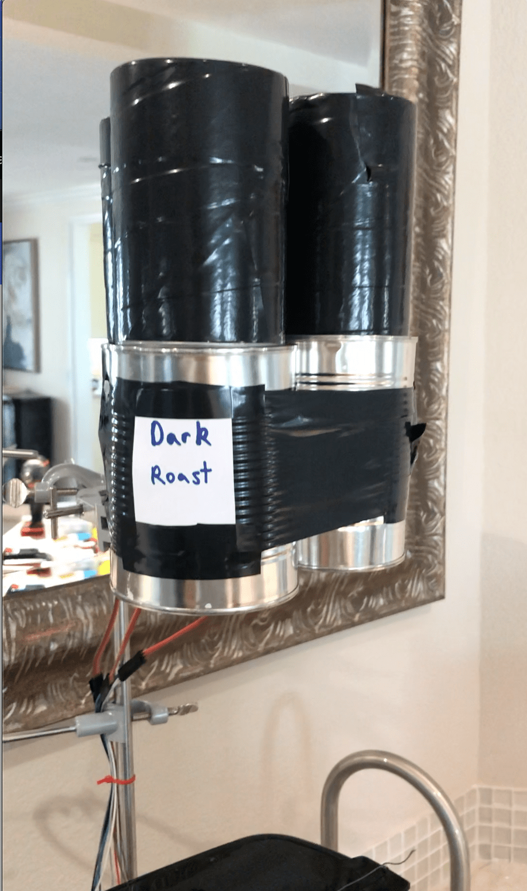

# CoffeeMachineIoT

### About
This is an automated IoT Coffee Machine I built that is controlled by a Raspberry Pi. When it is activated through a Siri Voice command such as "make coffee", it gathers Twitter activity from the past 24 hours from people tagging my account using the hashtags #darkroast, #mediumroast, or #lightroast and makes coffee with the roast of coffee bean that is voted on the most in this time period.
 
 
Siri is implemented through SiriControl an open source framework created by Sanjeet Chatterjee.

### Mechanics

#### Coffee Bean Dispenser
Each servo controls an individual coffee bean dispenser. These coffee bean dispensers are made up of Pringles cans for the top and fruit cans for the bottom. The servo is fixed on the fruit can and rotates the Pringles can. Both the fruit can and Pringles can have holes cut in them so during rotation of the Pringles can, these holes line up and the coffee beans fall out into the coffee machine.

* GPIO-4 controls the servo that dispenses Dark Roast
* GPIO-5 controls the servo that dispenses Medium Roast
* GPIO-17 controls the servo that dispenses Light Roast

#### Lid Closer

* GPIO-18 controls the servo that closes the Coffee Machine Lid

#### Start Button Presser

* GPIO-8 controls the servo that starts the Coffee Machine Brewing

#### OLED Screen

* A 0.96 Inch OLED screen acts as the display that shows which coffee bean was chosen and how many votes that bean had.

#### 3D-Printed Parts

* OLED Screen — [Thingiverse STL Link](https://www.thingiverse.com/thing:2176764) 
* Custom Servo Mount — See stls Folder
* Custom Servo Closing Lever — See stls Folder

#### Raspberry Pi & Wiring

* Raspberry Pi 3B+
* Breadboard
* Jumper Cables
* Resistors 
* 8-channel Relay

The breadboard has a separate power supply which powers the servos and oled display. The servos signal wire is placed in the breadboard where it connected to a resistor and to it's respective GPIO pin on the Raspberry Pi.

 
 
The 8-channel Relay was used for a previous iteration but it could still be used to plug the drip coffee machine into and an extra member function for the BrewCoffee class which turns the machine on before brewing and off when it is not in use to save power.

#### Software
The main files are
* **coffeecontrol.py** — This holds the BrewCoffee class that handles all the logic of the coffee machine
* **twitter.py** — Controls the Twitter Voting System
* **siricontrol.py** — Allowing Siri voice commands using Sanjeet Chatterjee's open source code
* **modules/coffeeModule.py** — The module for the siricontrol which triggers the coffee machine with the words "make coffee"

### Demonstration Video
#### Coffee Beans Pouring

#### Lid Closing And Brew Starting

#### OLED Screen Display

#### Closer Look At Start Button Servo

#### Coffee Good To Go

